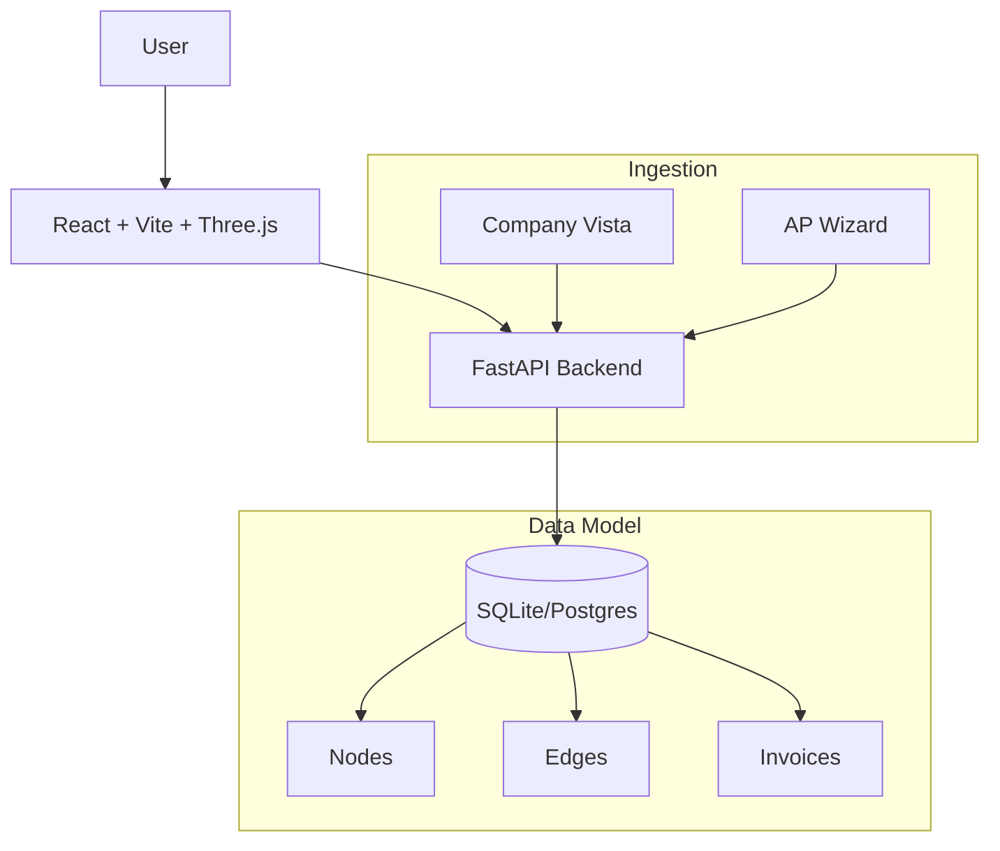

# APW Ontology - Capital Flow Master Dashboard

A Foundry-style application for visualizing and managing capital flows across Jobs, Vendors, and the Central Company, featuring an immersive **3D Graph Visualization**.

## 🌟 Key Feature: 3D Ontology Visualization

Experience your data like never before with our interactive 3D Graph Engine:

- **Immersive 3D Space**: Navigate through a universe of Vendors, Jobs, and Transactions in a fully interactive 3D environment.
- **Force-Directed Layout**: Automatically organizes complex relationships into intuitive clusters, revealing hidden patterns in your capital flow.
- **Interactive Exploration**: 
  - **Rotate, Zoom, & Pan**: Inspect the ontology from any angle.
  - **Node Highlighting**: Hover over nodes to instantly see connections and dependencies.
  - **Click-to-Focus**: Select any node to center the view and drill down into specific details.
- **Visual Analytics**: 
  - Node sizes dynamically represent transaction volume.
  - Color-coded connections indicate different types of relationships and flow status.

## Architecture

## Project Structure

- `backend/`: FastAPI server, database schema, and API logic.
- `frontend/`: React + TypeScript application (Vite) utilizing **Three.js** and **React Force Graph 3D**.
- `database/`: SQLite database file.
- `docs/`: Documentation and diagrams.

## Getting Started

### Backend

1. Navigate to `backend/`
2. Install dependencies: `pip install -r requirements.txt`
3. Run server: `python server.py`
4. API docs available at: `http://localhost:8002/docs`

### Frontend

1. Navigate to `frontend/`
2. Install dependencies: `npm install`
3. Run dev server: `npm run dev`

## Features

### M1: Proof of Concept & Visualization
- **3D Graph Visualization**: Interactive, force-directed 3D node-link diagram.
- **Drill-down**: Click on edges/nodes to see exact invoice details and history.
- **Audit Trail**: Immutable logs of all data changes.

### M2: Robust Ingestion & Matching
- **Identity Resolution**: Fuzzy matching (Levenshtein) to detect duplicate vendors.
- **Reconciliation Queue**: UI for manual approval of uncertain vendor matches.
- **Ingestion API**: Endpoints to ingest invoices and auto-resolve entities.

### M3: Audit & Merge
- **Audit Logging**: Complete history of all node/edge modifications.
- **Manual Merge**: Shift+Click two vendors to merge them.
- **Real-time Aggregates**: Inflow/Outflow stats calculated on-demand.

### M4 (Current): Filters & Central Company
- **Advanced Filters**: Filter by date range and transaction amount.
- **Central Company Node**: Visualize capital flows from company perspective.
- **Stats View**: Pre-computed aggregates for performance.

## Quick Start

1. **Backend**: `python backend/server.py`
2. **Frontend**: `cd frontend && npm run dev`
3. **Docs**: See `docs/TECHNICAL_REFERENCE.md`

## Testing

- `python backend/test_ingest.py` - Test ingestion & reconciliation
- `python backend/test_merge.py` - Test merge workflow

## Risks & Mitigations

See [RISKS.md](./RISKS.md) for a detailed analysis of 2nd and 3rd order consequences.
