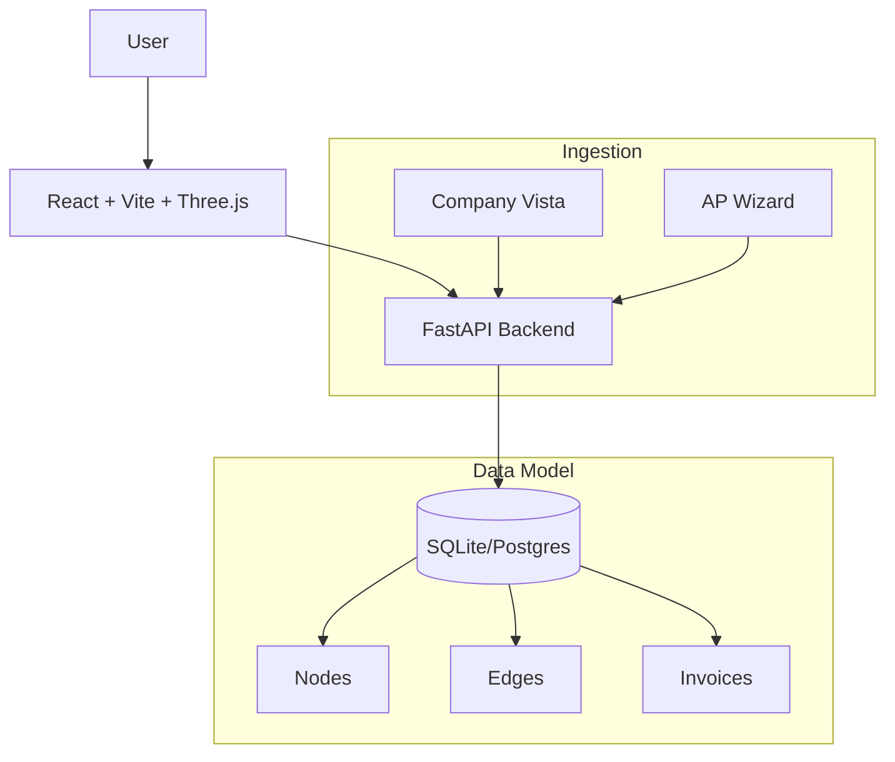

# APW Ontology - Capital Flow Master Dashboard

**A Full-Stack "Foundry-Style" Web Application for Capital Flow Intelligence.**

This project is a comprehensive **Ontology Management System** designed to visualize and manage complex relationships between Jobs, Vendors, and the Central Company. It goes beyond simple schema visualization, offering a fully interactive **3D Graph Engine**, robust data ingestion pipelines, and advanced reconciliation workflows.

## 🚀 Key Features

### 1. Immersive 3D Ontology Engine
*   **Interactive 3D Visualization**: Built with **Three.js** and **React Force Graph 3D**, allowing users to explore thousands of nodes and edges in a high-performance WebGL environment.
*   **Force-Directed Layout**: Automatically clusters related entities (e.g., Vendors around Jobs) to reveal hidden patterns in capital flow.
*   **Visual Analytics**: Node sizes, colors, and edge thicknesses dynamically represent transaction volumes and relationships.

### 2. Full-Stack Web Architecture
*   **Frontend**: Modern **React 19** application built with **Vite** and **TypeScript**. Features a polished, dark-themed UI with dockable panels, spotlight search, and smooth animations.
*   **Backend**: High-performance **FastAPI** server handling data ingestion, graph queries, and business logic.
*   **Database**: Flexible architecture using **SQLAlchemy** (currently SQLite for portability, easily scalable to PostgreSQL).

### 3. Advanced Data Management & "Time Travel"
*   **Ingestion & Resolution**: Intelligent pipelines that ingest raw invoice data and use fuzzy matching (Levenshtein distance) to resolve vendor identities.
*   **Reconciliation Queue**: A dedicated UI for human-in-the-loop resolution of uncertain matches.
*   **Audit Trail & History**: Complete history tracking for all nodes and edges. View the state of the ontology at any point in time (effectively a "Schema Diff" for your data).
*   **Manual Merge**: Powerful tools to merge duplicate vendor nodes with a complete audit log.

### 4. Interactive Exploration & Export
*   **Spotlight Search**: Instantly find and focus on any entity within the 3D graph.
*   **Time-Series Filtering**: Filter transactions by date range to visualize capital flow over specific periods.
*   **Data Export**: Export graph data and filtered views to **CSV** for external analysis.
*   **Synthetic Data Generator**: Built-in "Demo Mode" to generate realistic construction data for testing and demonstration.

## 🏗 Architecture

## 📂 Project Structure

*   `backend/`: **FastAPI** application.
    *   `server.py`: API entry point.
    *   `models.py`: Pydantic and SQLAlchemy models.
    *   `services/`: Business logic for ingestion, merging, and graph operations.
*   `frontend/`: **React** application.
    *   `src/components/Graph/`: 3D Graph visualization logic.
    *   `src/components/Panels/`: Detail views, filters, and reconciliation UI.
*   `docs/`: Comprehensive documentation and PRDs.

## ⚡ Getting Started

### Backend
1.  Navigate to `backend/`: `cd backend`
2.  Install dependencies: `pip install -r requirements.txt`
3.  Run server: `python server.py`
    *   *API runs at: `http://localhost:8002`*
    *   *Docs available at: `http://localhost:8002/docs`*

### Frontend
1.  Navigate to `frontend/`: `cd frontend`
2.  Install dependencies: `npm install`
3.  Run dev server: `npm run dev`
    *   *App runs at: `http://localhost:5173`*

## 🧪 Testing
*   `python backend/test_ingest.py`: Test the ingestion and identity resolution pipeline.
*   `python backend/test_merge.py`: Verify the vendor merge and audit logic.

## ⚠️ Risks & Mitigations
See [RISKS.md](./RISKS.md) for a detailed analysis of 2nd and 3rd order consequences, including performance limits of the 3D engine and data integrity strategies.
