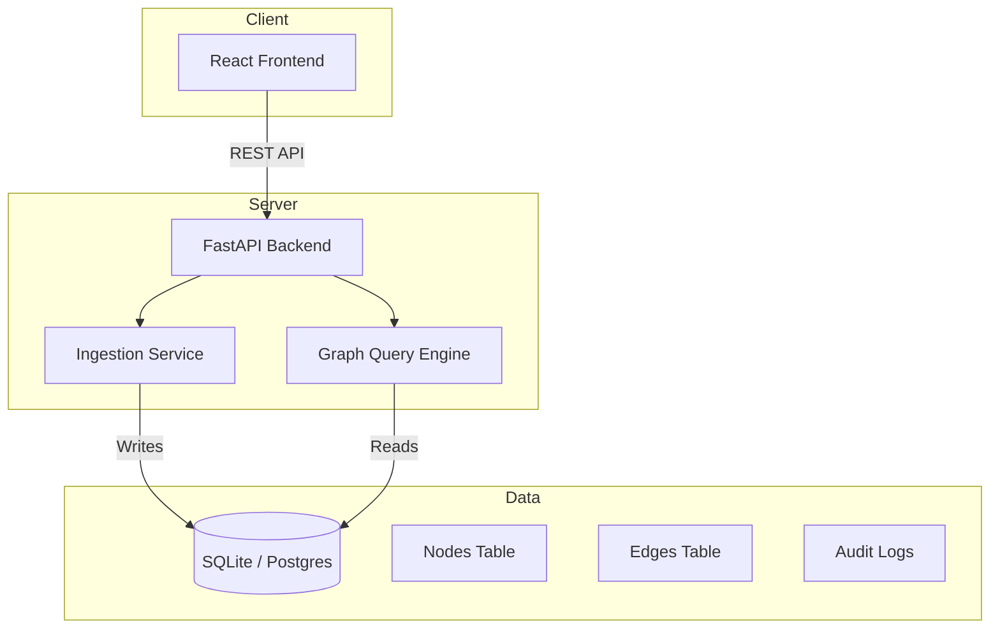

# Architecture

## High Level Overview

## Data Flow

1.  **Ingestion**: Invoices arrive via API (mocked for now).
2.  **Processing**: Invoices are normalized and resolved to Vendors/Jobs.
3.  **Storage**: Nodes and Edges are updated in the DB.
4.  **Visualization**: Frontend requests graph data (Nodes/Edges).
5.  **Interaction**: User clicks Edge -> Frontend requests Invoice Details.

## Database Schema

See `backend/schema.sql` for details.
